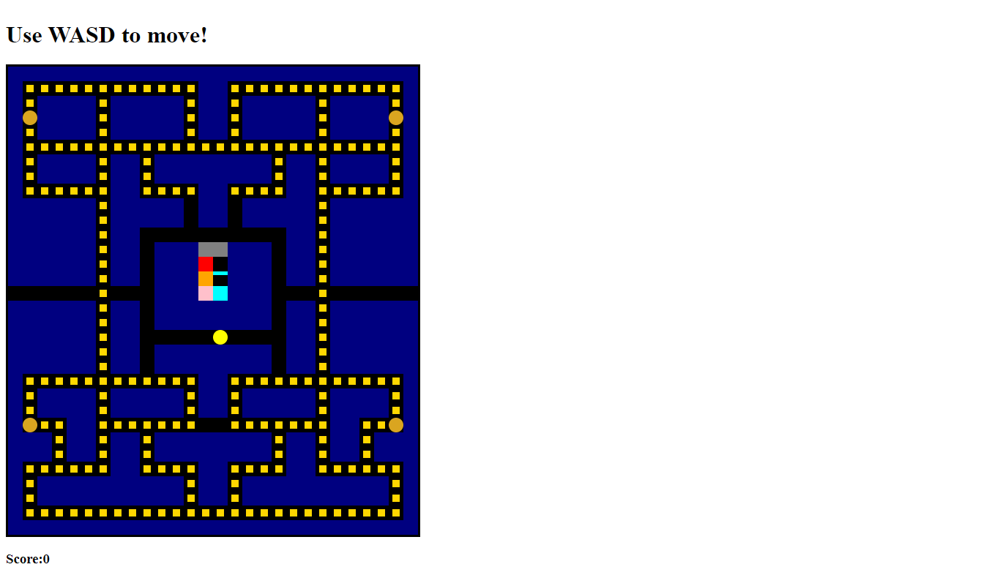

# PACMAN

PacMan but with arrays and DOM manipulation

# HOW TO PLAY

Use WASD tomove Pacman, around the array, eat all the dots and power pellets to win the game. When you eat a power pellet the ghosts become vulnerable and can be eaten. Collect bonus points by eating the fruit that appears and the ghosts. If the ghosts catch you, you lose.

## Technologies Used

HTML, CSS, JavaScript

## Start Up Screen:



# HOW TO INSTALL

1. _`Fork`_ and _`Clone`_ this respository to your local machine
2. Open `index.html` in your browser to play or
3. Open the directory in your text editor of choice to view or edit the code

# HOW IT WORKS

Use the WASD keys to move PacMan through the array to eat the dots and win the game.

```function renderBoard() {
for (let i = 0; i < layout.length; i++) {
const square = document.createElement("div");
grid.appendChild(square);
squares.push(square);

      if (layout[i] === 0) {
        squares[i].classList.add("dot");
      } else if (layout[i] === 2) {
        squares[i].classList.add("ghostLair");
      } else if (layout[i] === 1) {
        squares[i].classList.add("wall");
      } else if (layout[i] === 3) {
        squares[i].classList.add("powerPellet");
      } else if (layout[i] === 4) {
        squares[i].classList.add("path");
      }
    }
}
```

````function checkWin() {
    let totalScore = score + bonusScore;
    if (score === 282) {
      ghosts.forEach((ghost) => clearInterval(ghost.timerId));
      document.removeEventListener("keydown", movePacman);
      scoreDisplay.innerHTML = "YOU WIN! With a score of " + totalScore + "!";
    }
  }```

# FUTURE CONSIDERATIONS

I would like to add more levels, a starting screen and ending screen

# PROCESS WORK
````
